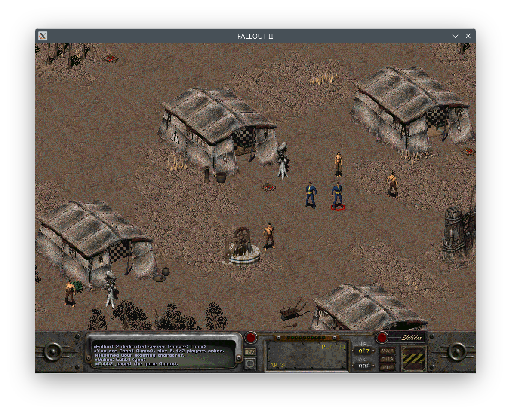
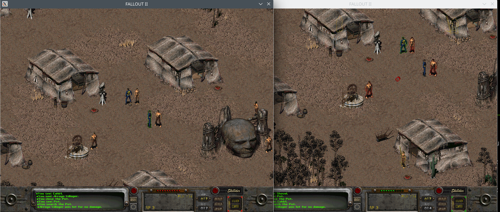
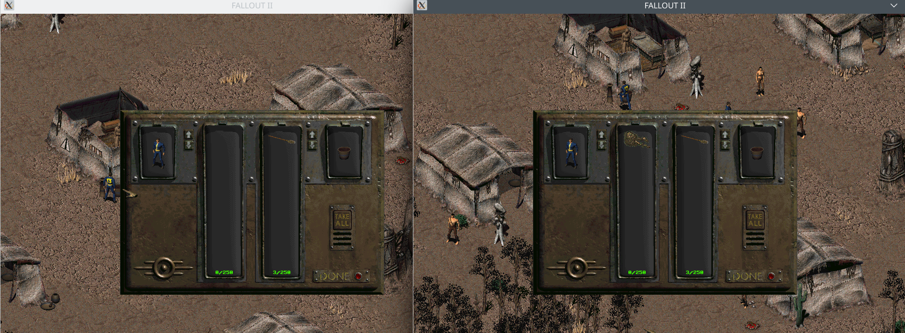
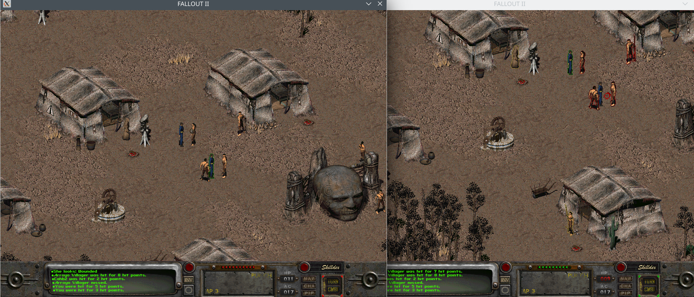

# Fallout 2 — Dedicated (co-op) Server & Client

A fork of [Fallout 2 Community Edition](https://github.com/alexbatalov/fallout2-ce) that
adds a **dedicated server** and turns the normal game binary into a **network client /
viewer**, so several players can share one persistent Fallout 2 world — co-op combat,
dialog, barter, worldmap travel and per-player characters.

Everything from upstream still works: this is the same faithful re-implementation of the
original engine, with the original gameplay, bugfixes and quality-of-life improvements. The
co-op layer is built *on top of* it — if you just want single-player, the client binary is
still the ordinary game (see [Single-player](#single-player-original--ce)).

> ⚠️ **AI-assisted project.** Large parts of the co-op layer — code and documentation (this
> README included) — were written with heavy use of AI coding assistants, under human direction
> and review. Disclosed up front so it's never a surprise: expect the rough edges that come with
> that (see the [FAQ](#faq--troubleshooting)), read the code before you rely on it, and bug
> reports are the best way to make it better.

> You must own Fallout 2 to play. Buy a copy on
> [GOG](https://www.gog.com/game/fallout_2),
> [Epic Games](https://store.epicgames.com/p/fallout-2) or
> [Steam](https://store.steampowered.com/app/38410). The engine ships no game assets — you
> supply `master.dat`, `critter.dat`, `patch000.dat` and the `data` folder from your own copy.

## How it fits together

There are two binaries:

- **`f2_server`** — the headless dedicated server. It owns the authoritative world (the sim,
  the clock, every actor) and streams it to viewers. It never renders anything itself.
- **`fallout2-ce`** — the normal game. Point it at a server with one env var and it becomes a
  network viewer/player; leave that env var unset and it's plain single-player.

The world model is **"empty = freeze, player = play, never quit on its own"**: with nobody
connected the sim is frozen (clock and NPCs paused) but the server keeps listening; the first
player to join un-freezes it; when the last one leaves it re-freezes and waits for reconnects.

## What works today

Native co-op of the original Fallout 2 — the real game, shared, not a rewrite:

- **Persistent dedicated world** — server owns the authoritative sim; players come and go.
- **Hot join / leave** — connect or drop mid-session; your character despawns and reattaches,
  the world keeps running for everyone else.
- **Accounts** — name-keyed identity: create a character (SPECIAL spec or vanilla's roll-a-char
  screen) the first time a name connects, then that name always returns as the same character.
- **Per-player characters** — each player has their own body, inventory, SPECIAL, skills, tags
  and perks, persisted per-actor in the save (not one shared sheet).
- **Save / load & autosave** — operator can `save`/`load` slots live; timed autosaves to slot 11.
  Co-op saves carry every player's own body, inventory and sheet.
- **Real-time inventory sync** — pick up, drop, wield, use, loot — mirrored to all viewers.
- **Synced combat** — beat-spanning turn-based combat with all players, including items and
  skills used mid-fight.
- **Synced dialog & barter** — live conversations and trading stream to viewers.
- **Synced cutscenes** — movies/videos project to every connected viewer in step.
- **Free-roam on the shared map** — walking, running and general presence sync between players
  on the same map.
- **Worldmap travel & random encounters** — global-map travel and encounters play out for the group.
- **Host-controlled transitions** — slot 0 (`F2_SERVER_HOST=`) is the host body and the only one
  that drives map transitions, worldmap travel and dialog, keeping the shared world coherent.

See [`DEDICATED_HOWTO.md`](DEDICATED_HOWTO.md) and the design docs in the repo root for launch
details, the full env-var/verb reference, and current edges and known limitations.

## Media

Two players sharing one world in Arroyo — the message log shows the co-op handshake (join,
slot, "players online"):



Two clients side by side, each its own viewpoint of the same shared map:



Real-time inventory / loot sync — the same container open on both clients:



Synced turn-based combat, with damage resolved for both players:



## Building

```sh
cmake -B build -DCMAKE_BUILD_TYPE=Release
cmake --build build --target f2_server fallout2-ce         # Linux/macOS
cmake --build build-win --target f2_server                 # Windows cross (mingw, wine-verified)
```

You need [SDL2](https://libsdl.org/download-2.0.php) for the client (`apt install libsdl2-2.0-0`
on Debian/Ubuntu). `build/f2_server` and `build/fallout2-ce` are what the launch scripts expect.

## Game assets

All binaries must run with their working directory set to the Fallout 2 game folder — they read
`master.dat` / `patch000.dat` relative to the CWD. Copy a Windows install's `Fallout2` folder
anywhere, or extract it from the GoG installer:

```sh
sudo apt install innoextract
innoextract ~/Downloads/setup_fallout2_2.1.0.18.exe -I app
mv app Fallout2
```

Depending on the distribution, the data files may be all-lowercase or all-uppercase. Either
rename them or update `master_dat` / `critter_dat` / `master_patches` / `critter_patches` in
`fallout2.cfg` to match. See [Configuration](#configuration) for the rest.

---

# Running a dedicated server

Run `f2_server` from the game folder. The minimum useful launch is **a world source plus a wire
port**:

```sh
cd Fallout2
env F2_SERVER_MAP=artemple.map F2_SERVER_NET=9200 F2_SERVER_CMD=9201 \
    F2_SERVER_PACE_MS=100 F2_SERVER_RESUMABLE_COMBAT=1 F2_SERVER_SMOOTH_WALK=1 \
    F2_SERVER_PRES_RECORD=1 F2_DIALOG_STREAM=1 F2_WORLDMAP_STREAM=1 \
    ../build/f2_server
```

For a proper "play it live" server you want that whole bundle of presentation flags on —
without them combat, dialog and travel won't stream to viewers.

**Channels**

- `F2_SERVER_NET=<port>` — the **viewer wire** (binary). Startup *blocks until the first client
  connects*, then serves; more clients join mid-stream.
- `F2_SERVER_CMD=<port>` — the **admin/command channel** (plain telnet/nc, one `verb arg` per
  line). Your operator console; works with or without a wire port.

**World source — pick exactly one**

- `F2_SERVER_MAP=<map.map>` — boot a fresh world on that map.
- `F2_SERVER_LOAD=<1-10>` — restore a save slot (`11` = autosave). If both are set, the load
  wins and the map is ignored.
- **Neither** → *lobby mode* (requires `F2_SERVER_CMD`): the server waits and you pick a world
  at runtime with `new <map.map>` or `load <n>`.

**Key server env vars** (full table below and in [`DEDICATED_HOWTO.md`](DEDICATED_HOWTO.md)):

| var | default | meaning |
|-----|---------|---------|
| `F2_SERVER_MAP` | — | boot a fresh world on this map |
| `F2_SERVER_LOAD` | — | restore save slot `1-10` (`11` = autosave) |
| `F2_SERVER_NET` | — | viewer wire TCP port (blocks for the first client) |
| `F2_SERVER_CMD` | — | admin/command TCP port (operator console) |
| `F2_SERVER_PACE_MS` | `0` (full speed) | ms wall per beat; `100` ≈ real time |
| `F2_SERVER_TICKS` | `0` = unlimited | serve forever; a positive value is a safety cap for headless runs |
| `F2_SERVER_KEEPALIVE` | on if `CMD` set | persistent: don't quit when the last player leaves; `=0` = exit-on-empty |
| `F2_SERVER_PLAYERS` | `1` | pre-spawn an N-body party on a fresh world (ignored on a co-op load) |
| `F2_SERVER_HOST` | first-come | pin slot 0 (the host body — drives worldmap/transitions/dialog) to an account name |
| `F2_SERVER_NAME` | — | server display name sent in the handshake |
| `F2_SERVER_RESUMABLE_COMBAT` | off | beat-spanning combat — **required** for combat presentation |
| `F2_SERVER_SMOOTH_WALK` | off | animate out-of-combat walks one tile per beat |
| `F2_SERVER_PRES_RECORD` | off | presentation record/replay (discrete-action animation) |
| `F2_DIALOG_STREAM` | off | live dialog + barter |
| `F2_WORLDMAP_STREAM` | off | live worldmap travel |
| `F2_AUTOSAVE_SECS` | `300` | autosave interval → slot 11; `0` = off |
| `F2_SERVER_SEED` | — | RNG seed (reproducible worlds/encounters) |

> ⚠ A server with **no `NET` and no `CMD` port** and unlimited ticks will spin a CPU core with
> no way to stop it but a signal. Always give it at least a `CMD` port or a positive `TICKS` cap.

## Operator console

The command channel takes one `verb arg arg2` per line over telnet/nc:

```sh
printf 'status\n'                  | nc -q1 127.0.0.1 9201
printf 'save 8 checkpoint\n'       | nc -q1 127.0.0.1 9201
printf 'spawn 41 3\n'              | nc -q1 127.0.0.1 9201
printf 'quit\n'                    | nc -q1 127.0.0.1 9201
```

Common admin verbs: `saves`, `save <1-10> [label]`, `load <1-10>` (lobby), `new <map.map>`
(lobby), `status`, `say <chan> <text>`, `movie <0-16>`, `timeskip <min>`, `spawn <pid> [n]`,
`stress <n> [pid]`, `despawnall`, `help`, `quit`/`shutdown`. Anything not an admin verb is
dispatched into the sim as a debug poke (movement/combat/inventory). Full vocabulary lives in
[`DEDICATED_HOWTO.md`](DEDICATED_HOWTO.md).

## Saving, loading & listing games

There are **11 slots**: `1-10` are manual, `11` is the autosave slot. A co-op save carries the
whole shared world *plus* every connected player's own body, inventory and character sheet, so a
restored world returns each account to exactly where it left off.

**List the slots** — `saves` reports every slot, whether it's used, and its label:

```sh
printf 'saves\n' | nc -q1 127.0.0.1 9201
```

**Save the running world** — `save <1-10> [label]`, any time, while players are connected:

```sh
printf 'save 8 before-temple\n' | nc -q1 127.0.0.1 9201
```

Autosaves are automatic to slot 11 on the `F2_AUTOSAVE_SECS` interval (300s by default; set
`F2_AUTOSAVE_SECS=0` to disable). Each autosave broadcasts "Game auto-saved." to viewers.

**Load a slot** — two ways:

1. **At startup**, restore instead of booting a fresh map (leave `F2_SERVER_MAP` unset):

   ```sh
   cd Fallout2
   env F2_SERVER_LOAD=8 F2_SERVER_NET=9200 F2_SERVER_CMD=9201 \
       F2_SERVER_RESUMABLE_COMBAT=1 F2_SERVER_SMOOTH_WALK=1 F2_SERVER_PRES_RECORD=1 \
       F2_DIALOG_STREAM=1 F2_WORLDMAP_STREAM=1 F2_SERVER_PACE_MS=100 \
       ../build/f2_server                       # F2_SERVER_LOAD=11 restores the autosave
   ```

2. **At runtime, from the lobby.** `load`/`new` only work when the server has no world yet —
   i.e. it was started with neither `F2_SERVER_MAP` nor `F2_SERVER_LOAD` (lobby mode needs a
   `F2_SERVER_CMD` port). From the console:

   ```sh
   printf 'saves\n'   | nc -q1 127.0.0.1 9201     # see what's available
   printf 'load 8\n'  | nc -q1 127.0.0.1 9201     # restore slot 8  (11 = autosave)
   printf 'new artemple.map\n' | nc -q1 127.0.0.1 9201   # or boot a fresh world
   ```

> To restore correctly, relaunch **without** any `CREATE*` / `F2_PLAYER_CREATE` vars — those are
> for *creating* new characters. On a load, existing accounts return as their saved selves; a new
> `F2_PLAYER_NAME` the save has never seen still needs a create spec to join.

---

# Running a client / viewer

The normal game binary becomes a network viewer when `F2_CLIENT_CONNECT` is set:

```sh
cd Fallout2
env F2_CLIENT_CONNECT=127.0.0.1:9200 F2_WINDOWED=1 \
    F2_PLAYER_NAME=Cahb F2_PLAYER_CREATE=ask ../build/fallout2-ce
```

| var | meaning |
|-----|---------|
| `F2_CLIENT_CONNECT=<host:port>` | connect to a server's wire port as a viewer/player |
| `F2_PLAYER_NAME=<name>` | account name to log in as (binds you to that name's character) |
| `F2_PLAYER_CREATE=<spec>` | first time this name is seen: `"S P E C I A L tags traits"` or `ask` to roll in the creation screen |
| `F2_PLAYER_TOKEN=<tok>` | auth token (needed if the server sets `F2_REQUIRE_TOKEN`) |
| `F2_WINDOWED=1` | run windowed (so multiple viewers fit side by side) |
| `F2_JOIN_TMP_CLIENT=<path>` | scratch file for the join blob; give each concurrent viewer its own |

Without `F2_CLIENT_CONNECT`, `fallout2-ce` is just the ordinary single-player game.

## Accounts & characters

Membership is **name-keyed**: `F2_PLAYER_NAME` is your identity. The first time the server sees
a name it creates that character (from `F2_PLAYER_CREATE`); afterwards the same name always
returns as the same character, with its own body, inventory and character sheet persisted in
the save.

- `F2_PLAYER_CREATE` is a SPECIAL stat spec — `"S P E C I A L tag tag tag trait trait"`
  (10+ ints) — or the literal `ask` to roll a character in vanilla's own creation screen before
  connecting.
- **Slot 0 is the host body** — the only one that can drive the worldmap, map transitions and
  dialog. Slots are first-come, so with interactive `ask` whoever finishes rolling first grabs
  it. Pin it deterministically with `F2_SERVER_HOST=<name>` on the server.
- `F2_REQUIRE_TOKEN=1` on the server requires each client to present a matching
  `F2_PLAYER_TOKEN`.

## All-in-one for local testing

`scripts/viewer_live.sh` boots the server *and* one or more viewers on a single box and tears
everything down when the first viewer quits. It sets the sane demo defaults for you:

```sh
# Solo viewer on the Temple map
scripts/viewer_live.sh

# Two players, each rolling their own character, host pinned so map-driving isn't a race
HOST=Cahb NAMES="Cahb,Mennoc" CREATE0=ask CREATE1=ask VIEWERS=2 PACE=100 scripts/viewer_live.sh

# Restore a save slot instead of a fresh map
LOAD=8 scripts/viewer_live.sh
```

See [`DEDICATED_HOWTO.md`](DEDICATED_HOWTO.md) for the script's knobs, persistence-test recipes,
the complete env-var and verb tables, and the dev/CI-only variables.

---

# Single-player (original -ce)

If you don't set `F2_CLIENT_CONNECT`, `fallout2-ce` is exactly upstream Fallout 2 Community
Edition — a drop-in replacement for `fallout2.exe`. Copy the binary into your `Fallout2` folder
and run it. Platform-specific asset setup (Windows / Linux / macOS / Android / iOS), controls
and localization notes are unchanged from upstream; see the
[Community Edition README](https://github.com/alexbatalov/fallout2-ce#readme).

Popular total-conversion mods are partially supported upstream. Original Nevada and Sonora
(those not relying on extended Sfall features) likely work; Restoration Project, Fallout Et Tu
and Olympus 2207 are not yet supported. There is also
[Fallout Community Edition](https://github.com/alexbatalov/fallout1-ce) (Fallout 1).

## Configuration

- **`fallout2.cfg`** — main config. Adjust `master_dat` / `critter_dat` / `master_patches` /
  `critter_patches` to match your asset file names, and `music_path1` to match your `sound/music`
  hierarchy (usually `data/sound/music/` or `sound/music/`; ACM music files are always uppercase).
- **`f2_res.ini`** — window size and fullscreen:

  ```ini
  [MAIN]
  SCR_WIDTH=1280
  SCR_HEIGHT=720
  WINDOWED=1
  ```

- **`ddraw.ini`** (part of Sfall) — engine/gameplay overrides for modders and advanced users;
  only a subset is implemented so far.

---

## FAQ / troubleshooting

This is co-op bolted onto a 1998 engine — it works, but there are rough edges. Bug reports are
genuinely appreciated; the more precise the repro, the faster it gets fixed.

**Q: How is this different from other Fallout 2 multiplayer attempts?**
A: The architecture. This fork cleanly splits the game in two: **the dedicated server is the only
thing running the Fallout 2 engine.** It ticks the simulation — the clock, every actor, every
script — and streams the resulting world out to the clients. The clients ("viewers") run *none*
of the original game logic; they only render the assets for what the server tells them is on
screen and send your input back. There's one authoritative world, and the server faithfully
wires its events out to everyone watching.

That design is also why co-op can occasionally feel broken. Faithfully re-broadcasting a
23-year-old single-player engine means every script opcode, event and quirk has to be *tapped*
and forwarded — and not all of them are yet, nor fully tested. Scripts are the hard part: they
use opcodes inconsistently, and the engine's notion of "the player" (`gDude`) is overloaded —
sometimes it means *the* protagonist, sometimes it means *whoever triggered this script*. Plenty
of vanilla scripts also assume only a single player ever interacts with them. Untangling that so
every script behaves correctly with multiple players is ongoing work, so some interactions won't
play out perfectly for everyone. When you hit one, a precise report (below) is exactly what moves
it forward.

**Q: My screen is black / the map didn't draw when I joined.**
A: Relog. Because you can hot-join a running world, disconnect and reconnect with the same
`F2_PLAYER_NAME` — the server re-streams the current map to you on reattach.

**Q: I can't move — we're in combat.**
A: It's turn-based: press **Space** to end/skip your turn. In some quirky scenarios the
"in combat" state can desync between server and viewer — if Space doesn't free you up and it
looks stuck, that's a bug worth reporting (see below).

**Q: Combat was synced at first, then went out of order.**
A: Known soft spot — combat sync has already been through two rewrites. If you hit this, the
single most useful thing you can tell us is **when** it diverged: what action was happening the
moment order broke (whose turn, melee vs ranged, a thrown/AoE weapon, an NPC turn, someone
joining/leaving mid-fight). That "when" is what pins the root cause.

**Q: It crashed / softlocked after a dialog option / a script fired / some specific action.**
A: Please **open an issue** with what you did right before it — the map, who was host, the exact
dialog choice or action, and any server stderr. These are exactly the reports we want; the
specific trigger is usually the whole fix.

**Q: A movie/cutscene played as a black screen (or nothing).**
A: Movies are off by default. The server needs `F2_MOVIES=1` **and** at least one viewer
connected when the cutscene triggers.

**Q: I can't travel the worldmap / do a map transition — nothing happens.**
A: By design only the **host body (slot 0)** drives map transitions, worldmap travel and dialog.
Set `F2_SERVER_HOST=<name>` so the host is a known player rather than first-come.

**Q: My character came back different / players grabbed the wrong bodies.**
A: Identity is the `F2_PLAYER_NAME` you log in with — reconnect with the same name. Slots are
first-come, so pin the host with `F2_SERVER_HOST=` to avoid a race for slot 0.

**Q: The server pins a CPU core / never stops.**
A: A server with no wire (`F2_SERVER_NET`) and no command (`F2_SERVER_CMD`) port and unlimited
ticks has no way to be told to stop. Always give it a `CMD` port (so you can `quit`) or a
positive `F2_SERVER_TICKS` cap.

## Credits & thanks

- **[Interplay Productions](https://en.wikipedia.org/wiki/Interplay_Entertainment) / Black
  Isle Studios** — the creators of Fallout 2 (1998). All game assets, art, audio and design
  are theirs; you must own the original game to play. This project ships none of that content.
- **[Fallout 2 Community Edition](https://github.com/alexbatalov/fallout2-ce)** by Alexander
  Batalov and contributors — the faithful engine re-implementation this fork is built on top of.
- **[Sfall](https://github.com/sfall-team/sfall)** — the extended-engine project whose fixes
  and features Community Edition integrates.
- Everyone in the wider Fallout modding and preservation community.

## License

The source code in this repository is available under the
[Sustainable Use License](LICENSE.md), inherited from Fallout 2 Community Edition. Fallout 2
and all related trademarks and game content are property of their respective owners
(Interplay / Bethesda). This is a non-commercial, fan re-implementation of the engine only.
</content>
</invoke>
